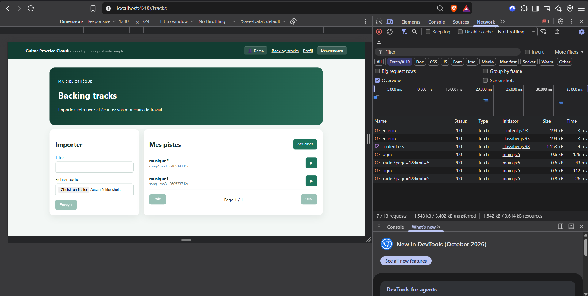

# Rapport d'usage de l'IA — TP1

> **Modèle utilisé** : Gemini 2.5 Flash / Claude 3.5 Sonnet (assistant Antigravity IDE)  
> **Contexte** : MIAGE M1 — Programmation Web 
> **Auteurs (Binôme)** : RAHARISON Leong Foc Sing Andhy, FOUILLOUD Valentin

---

## Mission 1 — Inscription, Connexion et Profil

---

### 1. Formulaires réactifs pour l’inscription et la connexion

- **Objectif** :  
  Construire les formulaires de connexion (`/login`) et d'inscription (`/register`) avec l'approche réactive d'Angular (`ReactiveFormsModule`, `FormGroup`, `FormControl`), en assurant un typage strict et une liaison propre avec le template HTML.

- **Prompt principal** :  
  > *« Je veux que tu me fasses la partie formulaires réactifs pour l'inscription et la connexion qui se trouve dans le fichier sujet_etudiant_tp1.md. J'aimerais que tu crées les formulaires de connexion d'inscription, qu'ils soient reliés au HTML et qu'ils gèrent le clic sur le bouton de validation»*

- **Plan proposé par l'agent** :  
  1. Importer `ReactiveFormsModule` dans les composants standalone [`LoginPageComponent`](frontend-starter/src/app/components/login-page/login-page.ts) et [`RegisterPageComponent`](frontend-starter/src/app/components/register-page/register-page.ts).
  2. Déclarer des `FormGroup` fortement typés avec l'option `{ nonNullable: true }` sur chaque `FormControl`.
  3. Relier les contrôles dans les templates via la directive `[formGroup]="form"` et les attributs `formControlName`.
  4. Intercepter la soumission `(ngSubmit)="submit()"` en vérifiant `this.form.invalid`, et déclencher `this.form.markAllAsTouched()` pour révéler les erreurs si l'utilisateur soumet un formulaire incomplet.

- **Vérifications réalisées par le binôme** :  
  - Saisie de données dans les champs et observation de la mise à jour réactive des valeurs.
  - Vérification dans les Angular DevTools que les contrôles de formulaire changent bien d'état (`pristine` → `dirty`, `untouched` → `touched`).
  - Test de soumission à vide : la requête HTTP n'est pas envoyée tant que le formulaire est invalide.

- **Erreurs ou propositions rejetées** :  
  - Rejet de l'approche *Template-driven Forms* (`[(ngModel)]` / `FormsModule`) qui mélange la logique de validation avec le template HTML et complique les tests unitaires.

- **Fichiers effectivement modifiés** :  
  - [`frontend-starter/src/app/components/login-page/login-page.ts`](frontend-starter/src/app/components/login-page/login-page.ts)
  - [`frontend-starter/src/app/components/login-page/login-page.html`](frontend-starter/src/app/components/login-page/login-page.html)
  - [`frontend-starter/src/app/components/register-page/register-page.ts`](frontend-starter/src/app/components/register-page/register-page.ts)
  - [`frontend-starter/src/app/components/register-page/register-page.html`](frontend-starter/src/app/components/register-page/register-page.html)

- **Preuve de fonctionnement** :  
  - Formulaires fonctionnels avec extraction typée des données via `this.form.getRawValue()`. Bouton de soumission désactivé pendant le chargement (`[disabled]="loading()"`).

- **Ce que chaque membre sait maintenant expliquer sans l'agent** :  
  - Pourquoi privilégier les formulaires réactifs aux formulaires pilotés par le template (meilleure séparation des responsabilités, testabilité directe dans la classe TypeScript, contrôle synchrone du statut de validation).
  - L'utilité de `{ nonNullable: true }` pour garantir que `.value` ou `.getRawValue()` renvoie toujours des chaînes de caractères et non `null` après un `.reset()`.

  

---

### 2. Validations et messages d'erreur compréhensibles

- **Objectif** :  
  Mettre en place des validateurs synchrones stricts respectant les règles du backend (nom $\ge$ 2 caractères, mot de passe $\ge$ 8 caractères, format email valide) et afficher des messages d'erreur clairs, compréhensibles et contextualisés (erreurs de saisie et retours HTTP de l'API).

- **Prompt principal** :  
  > *« Configure les validations des formulaires avec les validateurs Angular natifs, ajoute également une autre validation pour la correspondance des mots de passe, et affiches des messages d'erreurs compréhensible par tout le monde sous les champs touchés»*

- **Plan proposé par l'agent** :  
  1. Configurer les validateurs Angular natifs : `Validators.required`, `Validators.email`, `Validators.minLength(2)` pour le nom, `Validators.minLength(8)` pour le mot de passe.
  2. Créer une fonction de validation personnalisée (`passwordMatchValidator`) pour vérifier que le mot de passe et sa confirmation correspondent.
  3. Dans le HTML, conditionner l'affichage des erreurs avec la syntaxe de flux `@if (form.controls.field.touched && form.controls.field.hasError('...'))` pour ne pas agresser l'utilisateur avant qu'il n'ait interagi avec le champ.
  4. Créer des bannières d'alerte stylisées (`.alert-error`) pour traduire les codes HTTP retournés par le backend (`400 Bad Request`, `401 Unauthorized`, `409 Conflict`, `0 Erreur réseau`).
  5. Ajouter des retours visuels CSS (`.is-invalid`, bordure rouge) sur les champs en défaut.

- **Vérifications réalisées par le binôme** :  
  - Saisie d'un email malformé (`test@`) : le message *« Veuillez renseigner une adresse email valide »* s'affiche dès la perte de focus.
  - Saisie d'un mot de passe de moins de 8 caractères : le message *« Le mot de passe doit comporter au moins 8 caractères »* apparaît immédiatement.
  - Saisie de deux mots de passe différents lors de l'inscription : le message *« Les mots de passe ne correspondent pas »* bloque la validation.
  - Tentative d'inscription avec une adresse déjà existante (`demo@example.com`) : réception du code HTTP 409 et affichage de la bannière *« Cette adresse email est déjà utilisée par un autre compte »*.

- **Erreurs ou propositions rejetées** :  
  - Rejet d'un affichage des erreurs dès l'arrivée sur la page (`form.invalid` seul) : l'état `touched` a été rendu obligatoire pour préserver une expérience utilisateur de qualité.
  - Rejet de messages d'erreur génériques de type « Erreur » au profit de phrases explicites guidant l'utilisateur.

- **Fichiers effectivement modifiés** :  
  - [`frontend-starter/src/app/components/login-page/login-page.ts`](frontend-starter/src/app/components/login-page/login-page.ts)
  - [`frontend-starter/src/app/components/login-page/login-page.html`](frontend-starter/src/app/components/login-page/login-page.html)
  - [`frontend-starter/src/app/components/login-page/login-page.css`](frontend-starter/src/app/components/login-page/login-page.css)
  - [`frontend-starter/src/app/components/register-page/register-page.ts`](frontend-starter/src/app/components/register-page/register-page.ts)
  - [`frontend-starter/src/app/components/register-page/register-page.html`](frontend-starter/src/app/components/register-page/register-page.html)
  - [`frontend-starter/src/app/components/register-page/register-page.css`](frontend-starter/src/app/components/register-page/register-page.css)

- **Preuve de fonctionnement** :  
  - Messages d'erreur explicites sous les champs lors de saisies invalides ; coloration rouge immédiate ; messages d'erreur HTTP traduits et affichés dans les bannières d'alerte.

- **Ce que chaque membre sait maintenant expliquer sans l'agent** :  
  - La différence entre les états de validation d'Angular : `touched` (le champ a perdu le focus au moins une fois), `dirty` (la valeur a changé), `invalid` (au moins une règle échoue).
  - Comment écrire un validateur personnalisé au niveau du `FormGroup` pour comparer deux champs dépendants (`control.get('password')?.value !== control.get('confirmPassword')?.value`).

---

### 3. Appels de `/api/auth/register` et `/api/auth/login`

- **Objectif** :  
  Connecter les formulaires de l'interface utilisateur à l'API Express via [`AuthService`](frontend-starter/src/app/shared/services/auth.service.ts), en utilisant `HttpClient` dans le service et `inject()` dans les composants, conformément à `API_CONTRACT.md`.

- **Prompt principal** :  
  > *« Relie les formulaire à l'API en créant les méthodes login et register dans AuthService avec HttpClient, puis appelle les méthodes depuis les composants à l'aide d' inject() en gérant les états de chargement et les erreurs»*

- **Plan proposé par l'agent** :  
  1. Respecter la séparation des couches : ne jamais injecter `HttpClient` directement dans les composants ; toutes les requêtes HTTP doivent transiter par [`AuthService`](frontend-starter/src/app/shared/services/auth.service.ts).
  2. Implémenter les méthodes `login(email, password)` et `register(name, email, password)` renvoyant des `Observable<AuthResponse>`.
  3. Utiliser l'opérateur RxJS `tap()` pour déclencher les effets de bord (stockage de l'authentification) avant la notification au composant.
  4. Dans les composants, souscrire (`.subscribe()`) aux méthodes du service, gérer l'état de chargement (`loading.set(false)`), afficher les erreurs éventuelles ou rediriger (`router.navigateByUrl('/tracks')` ou `'/profile'`).
  5. Nettoyer les saisies avec `.trim()` sur les emails et noms pour éviter les espaces invisibles.

- **Vérifications réalisées par le binôme** :  
  - Test dans l'onglet **Network (Réseau)** des DevTools du navigateur avec le filtre **Fetch/XHR** :
    - Clic sur « Se connecter » : émission d'une requête HTTP `POST http://localhost:4200/api/auth/login`.
    - Code statut HTTP retourné : `200 OK`.
    - Corps de la réponse JSON vérifié : `{ "token": "...", "user": { "id": "...", "name": "Demo", "email": "demo@example.com" } }`.
  - Inscription d'un nouvel utilisateur : émission d'une requête `POST http://localhost:4200/api/auth/register` avec statut `201 Created`.
  - Redirection automatique vers la bibliothèque de backing tracks (`/tracks`) ou la page de profil (`/profile`).

- **Erreurs ou propositions rejetées** :  
  - Rejet de l'injection directe de `HttpClient` dans `LoginPageComponent` ou `RegisterPageComponent` (violation du principe de responsabilité unique et du sujet TP1).

- **Fichiers effectivement modifiés** :  
  - [`frontend-starter/src/app/shared/services/auth.service.ts`](frontend-starter/src/app/shared/services/auth.service.ts)
  - [`frontend-starter/src/app/components/login-page/login-page.ts`](frontend-starter/src/app/components/login-page/login-page.ts)
  - [`frontend-starter/src/app/components/register-page/register-page.ts`](frontend-starter/src/app/components/register-page/register-page.ts)

- **Preuve de fonctionnement** :  
  - Requêtes observables dans l'onglet Network (statuts 200 et 201) ; mise à jour instantanée du composant et redirection vers les routes protégées.

- **Ce que chaque membre sait maintenant expliquer sans l'agent** :  
  - Le flux complet d'une requête : Composant → `AuthService.login()` → `HttpClient.post()` → Proxy Angular (`proxy.conf.json` qui redirige vers le port 3000) → API Express (`app.post('/api/auth/login')`) → MongoDB (`User.findOne()`) → Réponse JSON.
  - Pourquoi le proxy Angular `proxy.conf.json` est nécessaire en développement pour éviter les blocages CORS.

---

### 4. Sauvegarde du JWT côté navigateur, sans jamais l’afficher dans les logs

- **Objectif** :  
  Conserver le jeton JWT côté navigateur afin de maintenir la session utilisateur active (survivre à un rafraîchissement F5 de la page), tout en respectant la consigne stricte de sécurité interdisant d'imprimer la valeur du token dans la console ou les fichiers de log.

- **Prompt principal** :  
  > *« Je veux que tu me fasses la partie sauvegarde du JWT côté navigateur, sans jamais l'afficher dans les logs qui se trouve dans le fichier sujet_etudiant_tp1.md. J'aimerais qu'on sauvegarde le token dans le localStorage et dans l'application pour rester connecté même après un rafraichissement, sans jamais l'afficher dans le console, et qu'on le supprime quand on se déconnecte »*

- **Plan proposé par l'agent** :  
  1. Centraliser la clé de stockage sous une constante dédiée (`const TOKEN_STORAGE_KEY = 'gpc_token'`).
  2. Dans la méthode privée `storeAuthentication(response: AuthResponse)` de [`AuthService`](frontend-starter/src/app/shared/services/auth.service.ts) :
     - Écrire le token dans le stockage navigateur : `localStorage.setItem(TOKEN_STORAGE_KEY, response.token)`.
     - Synchroniser le signal Angular réactif : `this.token.set(response.token)`.
     - Synchroniser les données publiques de l'utilisateur : `this.currentUser.set(response.user)`.
  3. À l'initialisation du service, initialiser le signal à partir du stockage : `readonly token = signal<string | null>(localStorage.getItem(TOKEN_STORAGE_KEY))`.
  4. Lors de la déconnexion (`logout()`), supprimer l'entrée : `localStorage.removeItem(TOKEN_STORAGE_KEY)` et remettre les signaux à `null`.
  5. Vérifier l'intégralité du code frontend pour s'assurer qu'aucun `console.log()` ou `console.debug()` n'affiche le token JWT ou le mot de passe.

- **Vérifications réalisées par le binôme** :  
  - **Vérification du stockage** : DevTools > onglet **Application** > rubrique **Storage** > **Local Storage** (`http://localhost:4200`) : la clé `gpc_token` contient bien la chaîne JWT (format `header.payload.signature`).
  - **Vérification de la sécurité des logs** : DevTools > onglet **Console** : seuls des messages discrets sans donnée sensible sont émis (`[LoginPage] Connexion réussie`, `[RegisterPage] Inscription réussie`). Aucune valeur de JWT n'apparaît.
  - **Test de persistance** : Rafraîchissement de la page (`F5`) sur la route `/tracks` : la session reste ouverte, l'utilisateur n'est pas renvoyé vers `/login`.
  - **Test de déconnexion** : Clic sur « Déconnexion » : la clé `gpc_token` disparaît immédiatement du `localStorage`, et l'accès aux routes protégées est de nouveau bloqué par le guard [`authGuard`](frontend-starter/src/app/shared/guards/auth.guard.ts).

- **Erreurs ou propositions rejetées** :  
  - Rejet de l'affichage de l'objet de réponse complet dans la console (ex: `console.log(response)`), car il contient le champ sensible `token`.
  - Rejet du stockage en simple variable mémoire JavaScript (qui réinitialiserait la session à chaque rafraîchissement d'onglet).

- **Fichiers effectivement modifiés** :  
  - [`frontend-starter/src/app/shared/services/auth.service.ts`](frontend-starter/src/app/shared/services/auth.service.ts)
  - [`frontend-starter/src/app/components/login-page/login-page.ts`](frontend-starter/src/app/components/login-page/login-page.ts)
  - [`frontend-starter/src/app/components/register-page/register-page.ts`](frontend-starter/src/app/components/register-page/register-page.ts)

- **Preuve de fonctionnement** :  
  - Token visible et persistant dans l'onglet **Application > Local Storage** ; console DevTools exempte de tout log de token.

- **Ce que chaque membre sait maintenant expliquer sans l'agent** :  
  - **Pourquoi ne jamais logger un JWT ?** : Le JWT est un jeton d'authentification au porteur (*Bearer token*). Toute personne ou script malveillant (extension de navigateur compromise, attaque XSS) accédant à la console ou aux logs peut dérober ce token et usurper l'identité de l'utilisateur sans connaître son mot de passe.
  - **Différence fondamentale entre `Signal` et `localStorage`** :
    - Le **`Signal`** est une primitive de réactivité en **mémoire vive** propre à Angular. Il notifie automatiquement les composants et déclenche le réaffichage du DOM dès que sa valeur change, mais il est volatil et disparaît au rechargement de la page.
    - Le **`localStorage`** est une API du navigateur qui écrit sur le **disque** du client. Les données y persistent même après fermeture du navigateur, mais il n'est pas réactif (Angular ne peut pas écouter nativement ses modifications).
    - **Architecture retenue** : Le `localStorage` assure la persistance inter-sessions, tandis que le `Signal` assure la réactivité intra-application.

---

### 5. Mise à jour du Signal `currentUser`

- **Objectif** :  
  Centraliser et gérer l'identité de l'utilisateur connecté de façon réactive dans toute l'application via le Signal Angular `readonly currentUser = signal<User | null>(null)`, en assurant sa mise à jour automatique lors de la connexion, de l'inscription, de la lecture du profil (`GET /api/users/me`), de la mise à jour du nom (`PUT /api/users/me`), et de la déconnexion.

- **Prompt principal** :  
  > *« Je veux que tu me fasses la partie mise à jour du Signal `currentUser` qui se trouve dans le fichier sujet_etudiant_tp1.md. J'aimerais qu'on puisse voir le nom de l'utilisateur en haut de l'écran dans le head, qu'il se mette à jour quand on modifie son compte ou qu'on se déconnecte, et qu'il recharge le profil automatiquement si on fait un rafraichissement »*

- **Plan proposé par l'agent** :  
  1. Définir le signal réactif `readonly currentUser = signal<User | null>(null)` dans [`AuthService`](frontend-starter/src/app/shared/services/auth.service.ts) en tant que source unique de vérité (*Single Source of Truth*).
  2. Mettre à jour la valeur du signal avec `.set(...)` aux 5 moments clés du cycle de vie :
     - **Connexion** (`login`) : `this.currentUser.set(response.user)`.
     - **Inscription** (`register`) : `this.currentUser.set(response.user)`.
     - **Chargement du profil** (`profile()`) : `.pipe(tap((user) => this.currentUser.set(user)))`.
     - **Modification du profil** (`update(name)`) : `.pipe(tap((user) => this.currentUser.set(user)))` pour refléter immédiatement le nouveau nom renvoyé par le backend.
     - **Déconnexion** (`logout()`) : `this.currentUser.set(null)`.
  3. Mettre en place la **réhydratation au rechargement** dans [`AppComponent`](frontend-starter/src/app/components/app/app.ts) : si un token existe dans `localStorage` mais que `currentUser()` est null (suite à un rafraîchissement F5), déclencher un appel silencieux à `auth.profile()` pour restaurer le profil en mémoire.
  4. Consommer le signal dans les templates avec la syntaxe réactive moderne `@if (auth.currentUser(); as user)` dans l'en-tête de navigation ([`app.html`](frontend-starter/src/app/components/app/app.html)) et sur la page de profil ([`profile-page.html`](frontend-starter/src/app/components/profile-page/profile-page.html)).

- **Vérifications réalisées par le binôme** :  
  - **Propagation instantanée lors de la connexion** : Après saisie des identifiants et clic sur « Se connecter », la barre de navigation affiche immédiatement le prénom et nom (`👤 Demo`) sans aucun rechargement de page.
  - **Propagation instantanée lors de la modification du nom** : Sur `/profile`, modification du nom en « Valentin F. » et clic sur « Enregistrer » : le nom est mis à jour en temps réel à la fois dans le badge du profil ET dans la barre de navigation en haut de l'écran, démontrant la puissance de la réactivité synchrone du signal.
  - **Pérennité au rafraîchissement (F5)** : Rafraîchissement de la page : le constructeur de [`AppComponent`](frontend-starter/src/app/components/app/app.ts) réhydrate `currentUser`, l'interface conserve le nom sans repasser par un état déconnecté.
  - **Nettoyage lors de la déconnexion** : Clic sur « Déconnexion » : `currentUser` repasse immédiatement à `null`, le header masque le nom et affiche à nouveau les liens de connexion/inscription.

- **Erreurs ou propositions rejetées** :  
  - Rejet de l'ancien modèle RxJS `BehaviorSubject` avec pipe `async` (`currentUser$ | async`) : les Signals natifs d'Angular offrent une granularité plus fine (*fine-grained reactivity*), ne nécessitent pas de désouscription manuelle pour éviter les fuites de mémoire, et allègent grandement la syntaxe des templates.
  - Rejet de la duplication d'état : aucun composant ne stocke une copie locale de l'objet utilisateur, ils lisent tous directement le signal exposé par [`AuthService`](frontend-starter/src/app/shared/services/auth.service.ts).

- **Fichiers effectivement modifiés** :  
  - [`frontend-starter/src/app/shared/services/auth.service.ts`](frontend-starter/src/app/shared/services/auth.service.ts)
  - [`frontend-starter/src/app/components/app/app.ts`](frontend-starter/src/app/components/app/app.ts)
  - [`frontend-starter/src/app/components/app/app.html`](frontend-starter/src/app/components/app/app.html)
  - [`frontend-starter/src/app/components/app/app.css`](frontend-starter/src/app/components/app/app.css)
  - [`frontend-starter/src/app/components/profile-page/profile-page.ts`](frontend-starter/src/app/components/profile-page/profile-page.ts)
  - [`frontend-starter/src/app/components/profile-page/profile-page.html`](frontend-starter/src/app/components/profile-page/profile-page.html)

- **Preuve de fonctionnement** :  
  - Nom affiché en direct dans la barre de navigation (`👤 Nom`) dès la connexion.
  - Synchronisation bidirectionnelle immédiate entre la page profil et l'en-tête lors d'une mise à jour du nom.
  - Disparition instantanée de toutes les informations utilisateur lors d'un clic sur « Déconnexion ».

- **Ce que chaque membre sait maintenant expliquer sans l'agent** :  
  - **Qu'est-ce qu'un Signal Angular ?** : Une boîte enveloppant une valeur qui notifie automatiquement le moteur de rendu d'Angular dès que sa valeur change via `.set()` ou `.update()`, déclenchant un réaffichage chirurgical du DOM sans réévaluer l'ensemble de l'arbre des composants.
  - **Rôle du service comme Source Unique de Vérité (*Single Source of Truth*)** : Un service injecté à la racine (`providedIn: 'root'`) est un singleton. En y plaçant le Signal `currentUser`, tous les composants de l'application partagent le même état d'authentification en temps réel.

---

### 6. Redirection après une connexion ou une inscription réussie

- **Objectif** :  
  Assurer une redirection fluide et cohérente de l'utilisateur vers la page principale de l'application (la bibliothèque de backing tracks `/tracks`) immédiatement après une connexion réussie (`/login`) ou une inscription réussie (`/register`), en tirant parti du routeur Angular (`Router.navigateByUrl`).

- **Prompt principal** :  
  > *« je veux que tu me fasses la partie rediction après une connexion ou une inscription réussite qui se trouve dans le fichier sujet_etudiant_tp1.md  
  > j'aimerais qu'après une connexion réussie et/ou une inscription réussi, tu me rediriges directement sur la page d'accueil avec la liste de toutes mes musiques (la page backing tracks) »*

- **Plan proposé par l'agent** :  
  1. Injecter le service `Router` dans les composants [`LoginPageComponent`](frontend-starter/src/app/components/login-page/login-page.ts) et [`RegisterPageComponent`](frontend-starter/src/app/components/register-page/register-page.ts) via `inject(Router)`.
  2. Dans le callback `next` de `auth.login().subscribe(...)` :
     - Désactiver l'indicateur de chargement : `this.loading.set(false)`.
     - Déclencher la navigation vers la page des backing tracks : `void this.router.navigateByUrl('/tracks')`.
  3. Dans le callback `next` de `auth.register().subscribe(...)` :
     - Corriger la redirection initiale (qui ciblait `/profile`) pour pointer directement vers `/tracks` : `void this.router.navigateByUrl('/tracks')`.
  4. S'assurer que le guard [`authGuard`](frontend-starter/src/app/shared/guards/auth.guard.ts) autorise l'accès à la route `/tracks` dès que le token JWT est mis en mémoire dans `AuthService`.

- **Vérifications réalisées par le binôme** :  
  - **Test de connexion réussie** : Saisie des identifiants valides sur `/login` puis clic sur « Se connecter » → redirection immédiate vers `/tracks` sans rechargement de page ; la liste des backing tracks se charge correctement via `TrackService.list()`.
  - **Test d'inscription réussie** : Création d'un nouveau compte sur `/register` puis validation → l'utilisateur est instantanément authentifié et dirigé vers `/tracks` (la liste de ses musiques) au lieu d'être bloqué ou envoyé sur la page profil.
  - **Test de robustesse des erreurs** : En cas d'erreur (ex. identifiants faux ou email déjà pris), la redirection ne s'exécute pas (arrêt dans le bloc `error`), et le message explicatif reste affiché.

- **Erreurs ou propositions rejetées** :  
  - Redirection de l'inscription vers `/profile` : rejetée conformément à la demande d'accès direct à l'accueil musical (`/tracks`).
  - Utilisation de `window.location.href = '/tracks'` : rejetée car cela déclenche un rechargement complet de l'application (perte de l'état SPA et lenteur inutile), au lieu d'une navigation interne avec le routeur Angular.

- **Fichiers effectivement modifiés** :  
  - [`frontend-starter/src/app/components/register-page/register-page.ts`](frontend-starter/src/app/components/register-page/register-page.ts) : mise à jour de la destination de navigation de `'/profile'` vers `'/tracks'`.
  - [`frontend-starter/src/app/components/login-page/login-page.ts`](frontend-starter/src/app/components/login-page/login-page.ts) : confirmation de la navigation vers `'/tracks'`.

- **Preuve de fonctionnement** :  
  - Redirection automatique et instantanée vers `/tracks` après connexion et inscription.
  - L'URL dans la barre d'adresse devient bien `http://localhost:4200/tracks` avec affichage de la liste des morceaux et du formulaire d'envoi.

- **Ce que chaque membre sait maintenant expliquer sans l'agent** :  
  - La méthode `router.navigateByUrl('/tracks')` résout la route cible de manière déclarative au sein du client Angular (SPA) sans faire de requête HTTP GET pour une nouvelle page HTML.
  - L'ordre d'exécution : la mise à jour synchrone du token dans `AuthService` (`tap(storeAuthentication)`) a lieu **avant** le callback `next` du composant, ce qui garantit que quand `router.navigateByUrl('/tracks')` est exécuté, [`authGuard`](frontend-starter/src/app/shared/guards/auth.guard.ts) vérifie `auth.token()` et laisse passer la navigation sans déclencher de redirection intempestive vers `/login`.

---

### 7. Bouton de déconnexion avec nettoyage de l’état local

- **Objectif** :  
  Permettre à l'utilisateur de mettre fin à sa session à tout moment via un bouton dédié (« Déconnexion »), en purgeant l'intégralité des traces de la session sur la machine (stockage persistant `localStorage`, `sessionStorage`) et en mémoire vive (Signaux Angular `token` et `currentUser`), puis en le redirigeant vers la page publique `/login`.

- **Prompt principal** :  
  > *« je veux que tu m'aides pour faire la partie bouton de déconnexion avec nettoyage de l'etat local dans le fichier sujet_etudiant_tp1.md. J'aimerais que quand on se déconnecte, l'application ne change pas simplement de page mais elle doit effacer toutes les traces de la session de l'utilisateur stockées sur la machine dans le navigateur»*

- **Plan proposé par l'agent** :  
  1. Dans [`AuthService`](frontend-starter/src/app/shared/services/auth.service.ts), centraliser l'effacement complet au sein de la méthode `logout()` :
     - Supprimer la clé du jeton : `localStorage.removeItem(TOKEN_STORAGE_KEY)`.
     - Vider tout stockage temporaire éventuel : `sessionStorage.clear()`.
     - Réinitialiser l'état réactif d'Angular : `this.token.set(null)` et `this.currentUser.set(null)`.
  2. Placer le bouton de déconnexion dans l'en-tête de navigation ([`app.html`](frontend-starter/src/app/components/app/app.html)) conditionné par `@if (auth.token())`, ainsi que sur la page de profil ([`profile-page.html`](frontend-starter/src/app/components/profile-page/profile-page.html)).
  3. Relier le clic `(click)="logout()"` dans [`AppComponent`](frontend-starter/src/app/components/app/app.ts) et [`ProfilePageComponent`](frontend-starter/src/app/components/profile-page/profile-page.ts) pour appeler `this.auth.logout()` puis déclencher la redirection : `void this.router.navigateByUrl('/login')`.
  4. Réutiliser ce même mécanisme de déconnexion automatique lors de la réception d'une erreur HTTP 401 dans [`authInterceptor`](frontend-starter/src/app/shared/interceptors/auth.interceptor.ts) ou lors de la suppression de compte (`deleteAccount()`).

- **Vérifications réalisées par le binôme** :  
  - **Test du clic de déconnexion** : Connexion préalable avec le compte de démonstration, puis clic sur le bouton « Déconnexion » dans la barre supérieure.
  - **Vérification du stockage (DevTools)** : Onglet **Application > Storage > Local Storage** : la clé `gpc_token` disparaît instantanément.
  - **Vérification de l'état en mémoire** : Le nom de l'utilisateur (`👤 Demo`) et les liens « Backing tracks » / « Profil » disparaissent immédiatement de la barre de navigation pour laisser place aux liens « Connexion » et « Inscription ».
  - **Test de protection des routes (Guard)** : Tentative de retour en arrière avec le bouton précédent du navigateur ou saisie manuelle de `http://localhost:4200/tracks` : le guard [`authGuard`](frontend-starter/src/app/shared/guards/auth.guard.ts) intercepte l'absence de token et renvoie automatiquement vers `/login`.

- **Erreurs ou propositions rejetées** :  
  - Rejet d'une simple redirection `router.navigateByUrl('/login')` sans purger le `localStorage` : la session réapparaîtrait au moindre rafraîchissement F5.
  - Rejet de l'utilisation de `window.location.reload()` pour forcer la déconnexion : la purge explicite des Signals et du stockage respecte l'architecture SPA sans rechargement brutal de la page.

- **Fichiers effectivement modifiés** :  
  - [`frontend-starter/src/app/shared/services/auth.service.ts`](frontend-starter/src/app/shared/services/auth.service.ts) : méthode `logout()` assurant le nettoyage complet de `localStorage`, `sessionStorage`, `token` et `currentUser`.
  - [`frontend-starter/src/app/components/app/app.html`](frontend-starter/src/app/components/app/app.html) & [`frontend-starter/src/app/components/app/app.ts`](frontend-starter/src/app/components/app/app.ts) : bouton de déconnexion dans la barre de navigation et méthode `logout()`.
  - [`frontend-starter/src/app/components/profile-page/profile-page.html`](frontend-starter/src/app/components/profile-page/profile-page.html) & [`frontend-starter/src/app/components/profile-page/profile-page.ts`](frontend-starter/src/app/components/profile-page/profile-page.ts) : bouton secondaire de déconnexion dans l'en-tête du profil.

- **Preuve de fonctionnement** :  
  - Clé `gpc_token` effacée du Local Storage à la déconnexion.
  - Réinitialisation instantanée de l'en-tête et redirection immédiate vers `/login`.
  - Blocage effectif de l'accès aux pages protégées après déconnexion.

- **Ce que chaque membre sait maintenant expliquer sans l'agent** :  
  - Pourquoi le nettoyage doit être double (disque + mémoire) : le `localStorage` doit être vidé pour empêcher la restauration de la session après F5, et les Signaux doivent être remis à `null` pour que l'interface graphique (DOM) et les Guards réagissent immédiatement sans recharger toute l'application.
  - Pourquoi centraliser ce nettoyage dans `AuthService.logout()` : afin que la déconnexion manuelle (bouton utilisateur), la déconnexion automatique sur token expiré (intercepteur 401) et la suppression de compte réutilisent exactement la même logique sécurisée.

---

### 8. Chargement de `/api/users/me` lorsque le profil est demandé

- **Objectif** :  
  Permettre à l'utilisateur de charger ses informations personnelles fraîches depuis la base de données MongoDB en effectuant une requête HTTP `GET /api/users/me` protégée par le jeton JWT, dès l'affichage de la page de profil (`/profile`) ou lors d'un clic sur le bouton « Rafraîchir ».

- **Prompt principal** :  
  > *« je veux que tu me fasse la partie chargement de `/api/users/me` lorsque le profil est demandé dans le fichier sujet_etudiant_tp1.md. J'aimerais que lorsque l'utilisateur veut voir son profil, le frontend doit utiliser une requête HTTP GET vers /api/users/me au backend pour récupérer ses informations personnelles depuis la base de données »*

- **Plan proposé par l'agent** :  
  1. Dans [`AuthService`](frontend-starter/src/app/shared/services/auth.service.ts), implémenter la méthode `profile()` qui émet la requête `GET /api/users/me` avec `HttpClient` et met à jour automatiquement le Signal `currentUser` via `tap((user) => this.currentUser.set(user))`.
  2. Vérifier que [`authInterceptor`](frontend-starter/src/app/shared/interceptors/auth.interceptor.ts) intercepte bien cette requête pour y injecter l'en-tête `Authorization: Bearer <token>`.
  3. Dans [`ProfilePageComponent`](frontend-starter/src/app/components/profile-page/profile-page.ts) :
     - Implémenter le hook de cycle de vie `ngOnInit()` pour déclencher `this.load()` dès l'ouverture de la page.
     - Ajouter des signaux d'état dédiés : `profileLoading = signal(false)` et `profileError = signal('')`.
     - Dans `load()`, souscrire à `this.auth.profile()` pour alimenter le formulaire (`nameForm.setValue({ name: user.name })`), et gérer les erreurs de connexion éventuelles.
  4. Dans [`profile-page.html`](frontend-starter/src/app/components/profile-page/profile-page.html) :
     - Remplacer le contenu statique par les données réactives de l'utilisateur (`user.name`, `user.email`, `user.createdAt`, avatar dynamique).
     - Relier le bouton « Rafraîchir » à `load()` en le désactivant (`[disabled]="profileLoading()"`) et en affichant un retour textuel pendant le chargement.
     - Afficher une bannière d'erreur conditionnelle `@if (profileError())` en cas d'échec de communication.

- **Vérifications réalisées par le binôme** :  
  - **Inspection Réseau (Network tab)** :  
    - Navigation vers `http://localhost:4200/profile` : émission instantanée de `GET /api/users/me`.
    - Présence de l'en-tête de requête : `Authorization: Bearer <token>`.
    - Code statut HTTP retourné par Express : `200 OK`.
    - Corps JSON de la réponse : `{ "id": "...", "name": "...", "email": "...", "createdAt": "..." }`.
  - **Affichage dynamique dans le DOM** : L'avatar circulaire prend la première lettre du prénom en majuscule, l'email et la date d'adhésion s'affichent correctement, et le champ « Nom complet » est prérempli avec la valeur issue de MongoDB.
  - **Bouton Rafraîchir** : Un clic sur « Rafraîchir » déclenche une nouvelle requête `GET /api/users/me` visible dans les DevTools avec bascule temporaire du bouton à l'état `Chargement...`.

- **Erreurs ou propositions rejetées** :  
  - Rejet du stockage des informations de profil complètes uniquement dans le JWT : le jeton ne doit contenir que le strict minimum (`sub`, `email`) et n'est pas actualisé si le nom change en base. Une requête `GET /api/users/me` garantit des données toujours fraîches.
  - Rejet de l'appel direct de `HttpClient` dans `ProfilePageComponent` afin de respecter la séparation claire entre composants et services.

- **Fichiers effectivement modifiés** :  
  - [`frontend-starter/src/app/shared/services/auth.service.ts`](frontend-starter/src/app/shared/services/auth.service.ts) : méthode `profile()` avec `HttpClient.get<User>('/api/users/me')`.
  - [`frontend-starter/src/app/components/profile-page/profile-page.ts`](frontend-starter/src/app/components/profile-page/profile-page.ts) : signaux `profileLoading` et `profileError`, méthode `load()` et hook `ngOnInit()`.
  - [`frontend-starter/src/app/components/profile-page/profile-page.html`](frontend-starter/src/app/components/profile-page/profile-page.html) : affichage dynamique des données, gestion du bouton de rafraîchissement et bannières d'alerte.

- **Preuve de fonctionnement** :  
  - Requête `GET /api/users/me` réussie avec statut 200 visible dans l'onglet Réseau des DevTools.
  - Données du profil pré-remplies et synchronisées en temps réel avec MongoDB.

- **Ce que chaque membre sait maintenant expliquer sans l'agent** :  
  - Le fonctionnement d'une route RESTful avec `me` : le backend sait qui fait la requête grâce au payload du JWT (`req.auth.sub`), sans qu'il soit nécessaire de passer l'identifiant dans l'URL.
  - Le rôle de l'intercepteur HTTP : `authInterceptor` intercepte automatiquement chaque requête sortante vers l'API et y injecte le header `Authorization: Bearer <token>` sans que le composant ou le service n'ait à manipuler manuellement les en-têtes.

---

### 9. Modification du nom avec `PUT /api/users/me`

- **Objectif** :  
  Permettre à l'utilisateur de modifier son nom complet depuis son profil en émettant une requête HTTP `PUT /api/users/me` vers le backend Express, enregistrer la nouvelle valeur dans la base MongoDB, et mettre à jour l'affichage en temps réel sur la page profil et dans la barre de navigation sans rechargement de page.

- **Prompt principal** :  
  > *« je veux que tu me fasses la partie modification du nom avec `PUT /api/users/me` dans le fichier sujet_etudiant_tp1.md. Je veux que l'utilisateur doit pouvoir modifier son nom complet depuis son profil et que cette modification doit être envoyé au backend grace a une requête HTTP PUT pour enregistrer les modifications dans la base de données afin de l'afficher en temps réel sur la page profil »*

- **Plan proposé par l'agent** :  
  1. Côté Frontend Service ([`AuthService`](frontend-starter/src/app/shared/services/auth.service.ts)) :
     - Implémenter `update(name: string)` émettant `HttpClient.put<User>('/api/users/me', { name })`.
     - Chaîner l'opérateur RxJS `tap((user) => this.currentUser.set(user))` pour synchroniser instantanément le Signal réactif `currentUser` avec l'objet retourné par l'API.
  2. Côté Frontend Composant ([`ProfilePageComponent`](frontend-starter/src/app/components/profile-page/profile-page.ts)) :
     - Déclarer un formulaire réactif `nameForm` avec contrôle `name` (`Validators.required`, `Validators.minLength(2)`).
     - Dans `saveName()`, valider le formulaire, nettoyer la saisie avec `.trim()`, activer l'état de chargement `nameLoading.set(true)`, et appeler `this.auth.update(newName)`.
     - En cas de succès, afficher la confirmation visuelle (`nameMessage`), réinjecter la valeur normalisée et éteindre le spinner.
     - En cas d'erreur (statut 0, 400, etc.), intercepter le retour et afficher un message d'alerte contextualisé (`nameError`).
  3. Côté Frontend Template ([`profile-page.html`](frontend-starter/src/app/components/profile-page/profile-page.html)) :
     - Relier le formulaire à `[formGroup]="nameForm"` et `(ngSubmit)="saveName()"`.
     - Exploiter la réactivité du Signal `auth.currentUser()` pour mettre à jour instantanément le titre `<h2>{{ user.name }}</h2>`, le badge avatar `{{ user.name.charAt(0) }}` et le nom dans l'en-tête global ([`app.html`](frontend-starter/src/app/components/app/app.html)).
  4. Côté Backend ([`backend/src/app.js`](backend/src/app.js)) :
     - Définir le handler `app.put('/api/users/me', auth, ...)` qui extrait `req.auth.sub`, exécute `User.findByIdAndUpdate(req.auth.sub, { $set: { name: req.body?.name } }, { new: true, runValidators: true })`, et répond avec le profil public `user.toPublic()`.

- **Vérifications réalisées par le binôme** :  
  - **Inspection Réseau (Network tab)** :  
    - Modification du nom dans le champ puis clic sur « Enregistrer les modifications ».
    - Émission de la requête HTTP : méthode `PUT`, URL `http://localhost:4200/api/users/me`.
    - En-tête : `Authorization: Bearer <token>`, `Content-Type: application/json`.
    - Corps JSON de la requête : `{ "name": "Valentin F." }`.
    - Statut HTTP reçu : `200 OK`.
    - Corps JSON de la réponse : objet utilisateur complet avec le nouveau `name`.
  - **Réactivité instantanée dans le DOM** : Dès la réception de la réponse 200, le badge avec l'initiale, le titre de l'encart de profil et le bandeau de navigation (`👤 Valentin F.`) changent simultanément sans aucun rafraîchissement d'onglet.
  - **Pérénité dans MongoDB** : Rafraîchissement complet (`F5`) de la page : le nouveau nom reste affiché car la persistance en base de données MongoDB Atlas est effective.

- **Erreurs ou propositions rejetées** :  
  - Rejet de l'envoi d'espaces blancs non nettoyés : ajout du `.trim()` pour éviter d'enregistrer des noms composés uniquement d'espaces.
  - Rejet de la duplication d'état local : le composant profil ne gère pas son propre signal séparé pour le nom ; il délègue la vérité au Signal `AuthService.currentUser`, garantissant une cohérence globale dans toute l'application.

- **Fichiers effectivement modifiés** :  
  - Côté Frontend :  
    - [`frontend-starter/src/app/shared/services/auth.service.ts`](frontend-starter/src/app/shared/services/auth.service.ts) (méthode `update`)
    - [`frontend-starter/src/app/components/profile-page/profile-page.ts`](frontend-starter/src/app/components/profile-page/profile-page.ts) (gestion du formulaire et méthode `saveName`)
    - [`frontend-starter/src/app/components/profile-page/profile-page.html`](frontend-starter/src/app/components/profile-page/profile-page.html) (formulaire de nom, alertes et affichage réactif)
  - Côté Backend (vérifié) :  
    - [`backend/src/app.js`](backend/src/app.js) (route `app.put('/api/users/me')`)
    - [`backend/src/models/User.js`](backend/src/models/User.js) (schéma Mongoose `name`)

- **Preuve de fonctionnement** :  
  - Requête HTTP `PUT /api/users/me` visible avec code 200 dans l'onglet Network.
  - Message de succès vert « Nom modifié avec succès. » affiché sous le champ.
  - Mise à jour immédiate et simultanée du badge avatar, du titre du profil et du header.

- **Ce que chaque membre sait maintenant expliquer sans l'agent** :  
  - Réponse à la question du sujet (*« où s'effectue la tâche “mise à jour du profil utilisateur”, dans quels fichiers côté back et côté front ? »*) :
    - Côté front : dans [`profile-page.ts`](frontend-starter/src/app/components/profile-page/profile-page.ts) (UI), [`auth.service.ts`](frontend-starter/src/app/shared/services/auth.service.ts) (appel HTTP + mise à jour du Signal) et [`auth.interceptor.ts`](frontend-starter/src/app/shared/interceptors/auth.interceptor.ts) (injection du JWT).
    - Côté back : dans [`backend/src/app.js`](backend/src/app.js) (route `app.put('/api/users/me')` protégée par le middleware `auth`) et [`backend/src/models/User.js`](backend/src/models/User.js) (modèle Mongoose).
  - La sémantique HTTP : pourquoi utiliser `PUT` et non `POST` (car il s'agit d'une mise à jour idempotente d'une ressource existante identifiée).

---

### 10. Gestion d’un `401`, avec retour vers `/login` si le token est invalide ou expiré

- **Objectif** :  
  Intercepter de manière globale et transparente toute réponse HTTP `401 Unauthorized` provenant du backend (survenue lors de l'expiration du token après 2h ou en cas de jeton invalide/falsifié), purger l'état de session local (stockage et mémoire) via `AuthService.logout()`, et rediriger automatiquement l'utilisateur vers la page de connexion (`/login`) avec un message d'information explicatif.

- **Prompt principal** :  
  > *« j'aimerais que tu me fasse la partie gestion d’un `401`, avec retour vers `/login` si le token est invalide ou expiré. je veux que si je le token est expiré, ça redirige directement l'utilisateur sur la page de connexion et si l'erreur 401 vient de l'invaliditié du token alors je veux aussi que tu rediriges le client directement dans la page de de connexion»*

- **Plan proposé par l'agent** :  
  1. Dans l'intercepteur HTTP global [`authInterceptor`](frontend-starter/src/app/shared/interceptors/auth.interceptor.ts) :
     - Utiliser l'opérateur RxJS `catchError()` pour capturer toute erreur de type `HttpErrorResponse`.
     - Vérifier la condition : `error.status === 401 && !request.url.includes('/api/auth/login')`. (L'exclusion de `/api/auth/login` évite une boucle de redirection en cas de mot de passe erroné lors de la saisie).
     - Si l'erreur 401 survient (jeton expiré ou signature invalide) :
       - Déclencher le nettoyage complet : `auth.logout()` (suppression de `gpc_token` du `localStorage`, `sessionStorage.clear()`, et remise à `null` des Signaux `token` et `currentUser`).
       - Rediriger automatiquement vers `/login` en passant un paramètre de requête : `void router.navigate(['/login'], { queryParams: { sessionExpired: 'true' } })`.
  2. Dans [`LoginPageComponent`](frontend-starter/src/app/components/login-page/login-page.ts) :
     - Injecter `ActivatedRoute` et initialiser un Signal `sessionExpiredMessage` si le paramètre `sessionExpired` est détecté dans l'URL.
     - Afficher une bannière d'information bleue conviviale dans [`login-page.html`](frontend-starter/src/app/components/login-page/login-page.html) : *« Votre session a expiré ou votre jeton est invalide. Veuillez vous reconnecter. »*.
     - Réinitialiser le message dès qu'une nouvelle tentative de connexion est soumise.
  3. Dans le guard [`authGuard`](frontend-starter/src/app/shared/guards/auth.guard.ts) :
     - Confirmer que l'absence de jeton suite au `logout()` bloque l'accès aux routes protégées et renvoie tout accès direct vers `/login`.

- **Vérifications réalisées par le binôme** :  
  - **Simulation de token falsifié/invalide** :  
    - Modification manuelle du token dans `localStorage` (altération de quelques caractères de la signature JWT via l'onglet Application des DevTools).
    - Tentative de navigation vers `/tracks` ou clic sur « Rafraîchir » dans le profil.
    - Émission de la requête avec le token corrompu → Réponse immédiate du backend Express : `401 Unauthorized` (`{ "message": "Jeton invalide ou expiré" }`).
    - Comportement observé : `authInterceptor` intercepte le 401, purge la session, et redirige instantanément vers `http://localhost:4200/login?sessionExpired=true`.
    - Affichage immédiat de la bannière bleue d'avertissement : *« Votre session a expiré ou votre jeton est invalide. Veuillez vous reconnecter. »*.
  - **Simulation de token expiré** :  
    - Vérification du middleware backend [`backend/src/app.js`](backend/src/app.js#L57-L78) : `jwt.verify(token, SECRET)` lève automatiquement une `TokenExpiredError` après 2 heures, interceptée de la même façon par `authInterceptor`.
  - **Non-interférence avec la page de connexion** :  
    - Saisie d'un mot de passe incorrect sur `/login` : le backend renvoie un 401, mais l'intercepteur ignore cette URL et laisse [`LoginPageComponent`](frontend-starter/src/app/components/login-page/login-page.ts) afficher le message d'erreur rouge approprié (*« Identifiants incorrects »*) sans recharger la page.

- **Erreurs ou propositions rejetées** :  
  - Rejet de la gestion des erreurs 401 au cas par cas dans chaque composant ou service : l'intercepteur HTTP centralise 100% des flux d'erreur réseau en un point unique, évitant tout oubli et toute duplication.
  - Rejet de la redirection brutale sans avertissement à l'utilisateur : le paramètre `sessionExpired=true` et la bannière informative expliquent clairement la raison du retour au formulaire de connexion.

- **Fichiers effectivement modifiés** :  
  - [`frontend-starter/src/app/shared/interceptors/auth.interceptor.ts`](frontend-starter/src/app/shared/interceptors/auth.interceptor.ts) : détection de l'erreur 401, appel de `auth.logout()` et redirection avec query param.
  - [`frontend-starter/src/app/components/login-page/login-page.ts`](frontend-starter/src/app/components/login-page/login-page.ts) : lecture du query param via `ActivatedRoute` et gestion de `sessionExpiredMessage`.
  - [`frontend-starter/src/app/components/login-page/login-page.html`](frontend-starter/src/app/components/login-page/login-page.html) : affichage de la bannière d'information `.alert-info`.
  - [`frontend-starter/src/app/components/login-page/login-page.css`](frontend-starter/src/app/components/login-page/login-page.css) : style visuel de la bannière d'information.

- **Preuve de fonctionnement** :  
  - Erreur 401 visible dans l'onglet Réseau des DevTools.
  - Redirection automatique et immédiate de l'URL vers `/login?sessionExpired=true`.
  - Purge intégrale du `localStorage` et affichage clair de l'alerte invitant à se reconnecter.

- **Ce que chaque membre sait maintenant expliquer sans l'agent** :  
  - Le cycle de vie d'un intercepteur HTTP : il s'insère comme un middleware côté client sur la chaîne de traitement `HttpClient`, permettant d'enrichir la requête à l'aller (`Authorization`) et d'intercepter les statuts HTTP au retour (`catchError`).
  - Pourquoi exclure `/api/auth/login` de la capture 401 : pour ne pas confondre une tentative de connexion avec de mauvais identifiants (qui doit rester sur la page de login avec le formulaire en rouge) et une session protégée expirée (qui nécessite un nettoyage de session et une redirection).

